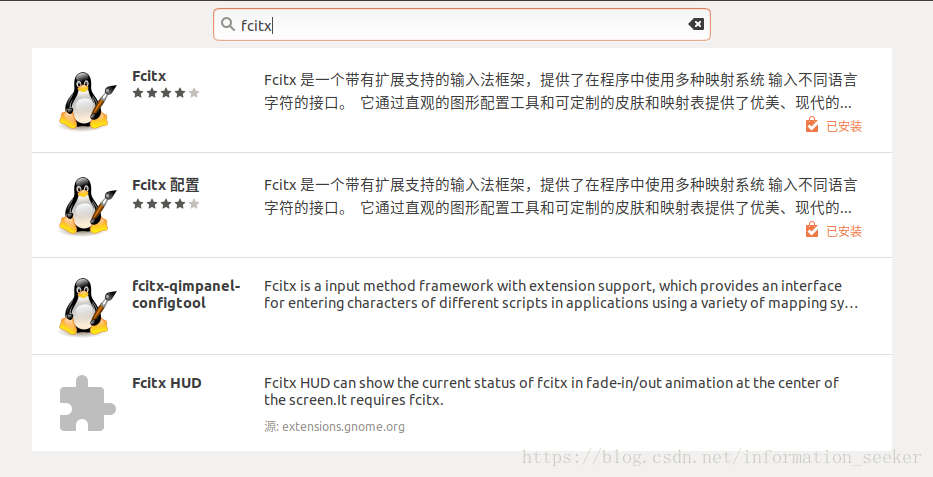

### 第一步

在ubuntu软件中搜索fcitx并安装



### 第二步

官网下载搜狗Linux版本

```java
sudo gdebi Linux版本
```

### 第三步

进入设置->区域和语言->管理已安装的语言->键盘输入法系统改为fcitx->应用到整个系统

### 第四步

点击右上角键盘标志->配置->将搜狗输入法改为第一个

如果没有键盘标志，重启电脑

