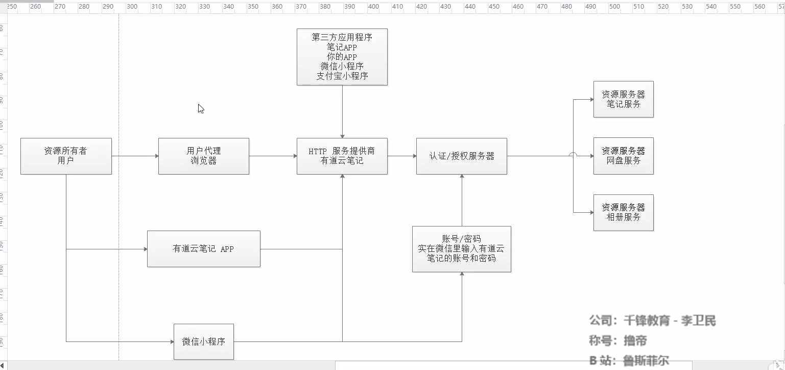

### Spring Security oAuth2

- 简介
  - spring Security是一个框架，oAuth2是一个协议，他的主要作用就是为了提供认证和授权的规范，这种认证机制适用于个人消费者类的互联网产品，如社交类APP等应用，但是不太适合拥有自有认证权限管理的企业应用
- 为什么需要oAuth2
  - 涉及到单点登录问题
  - 和第三方应用合作，需要用户提供账号和密码给第三方应用程序，让他记录后再访问我们的资源？意思就是，假如有一个第三方应用“打印”想打印你在腾讯云文档中的一篇文档，传统方法是将你的用户名和密码告诉这个第三方应用，然后这个第三方应用就可以读取你的文档并打印，所以这种做法很不安全。
  - 授权范围和使用期限
  - 不想使用账号密码的方式给第三方应用授权
  - 只要有一个接入的第三方应用程序遭到破解，那么用户的密码就会遭到泄露

