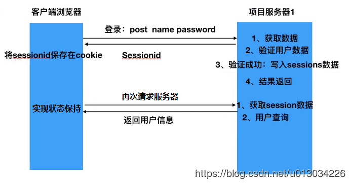

### 为什么使用token

通常用户第一次通过浏览器使用用户名和密码访问服务器时，服务器会验证用户数据，验证成功后在服务器端写入session数据，向浏览器返回sessionid,浏览器将sessionid保存在cookie中，当用户再次访问服务器时，会携带sessionid,服务器会拿着sessionid从数据库中获取session数据，然后进行用户信息查询，查询到，将查询结果返回，从而实现状态保持。



```properties
弊端：
1.服务器压力增大
		通常session是存储在内存中的，每个用户通过认证之后都会将session保存在服务器的内存中，而当用户量增大时，服务器的压力也会随之增大
2.CSRF跨站伪造请求攻击
		session是基于cookie进行用户识别的，如果cookie被截获，用户很容易搜到跨站请求伪造的攻击
3.扩展性不强
		如果将来搭建了多个服务器，虽然每个服务器都执行的是同样的业务逻辑，但是session是存在与每个服务器中的内存中，不是共享的，用户第一次访问的是服务器1，当用户再次请求时可能访问的就是另一台服务器，就会判定用户没有登陆过
```

### CSRF简介

简单来说就是在用户访问一个网站之后不久，在cookie还没失效的情况下，访问了一个钓鱼网站，然后在用户不知情的情况下向我之前访问的网站做一些对用户做一些不好的事情，例如偷偷转账


