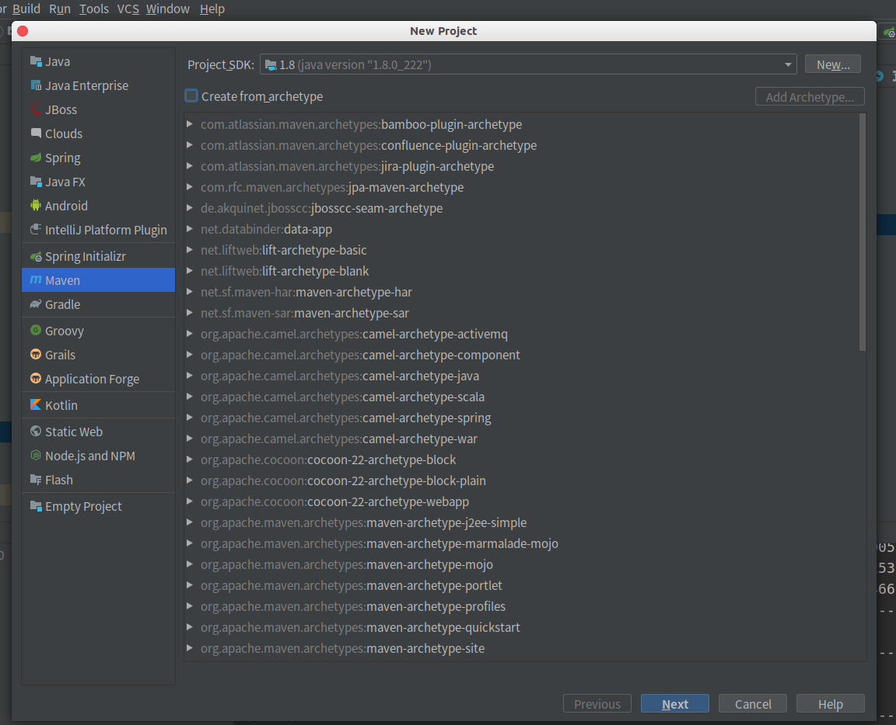
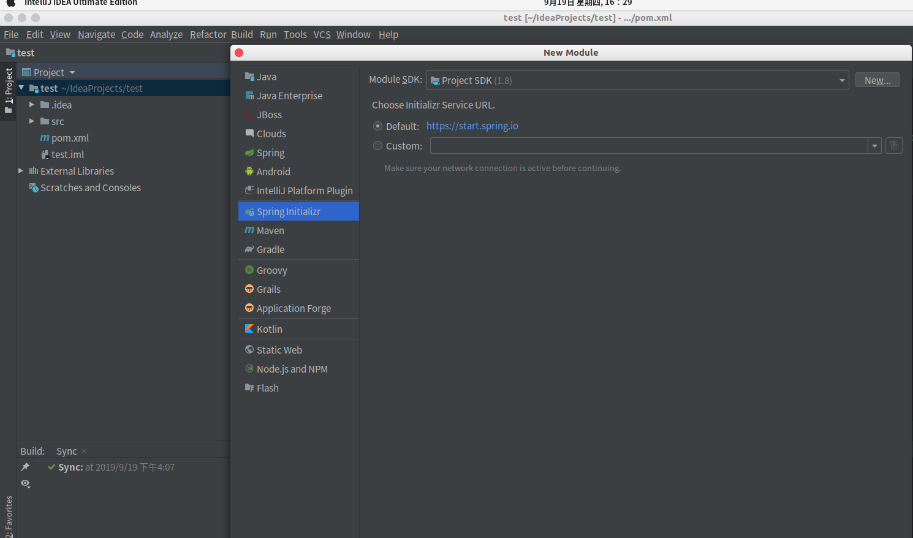
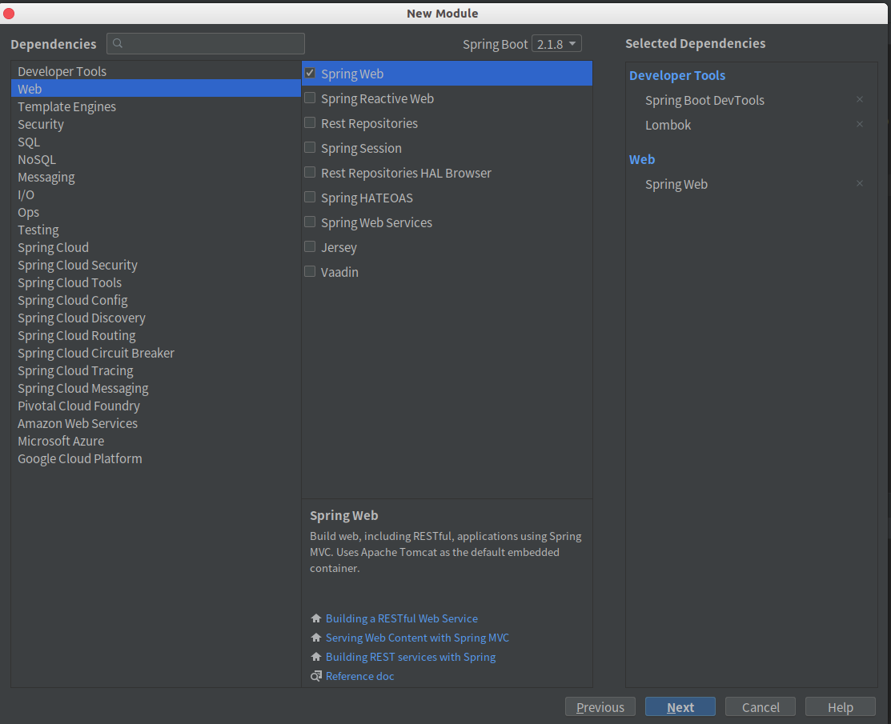
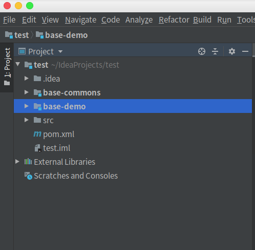

# spring boot 多模块项目的构建

### 1.构建Maven项目

```java
因为只是使用它作为主工程，所以不用选择任何创建骨架，创建好后删除src目录
```



### 2.在主工程上右键创建Module

```java
例如创建base-demo项目作为主项目，创建时添加项目所需依赖(例如第二张图)
然后创建base-commons项目作为所有项目的公共项目，步骤如创建base-demo，只是公共项目不需要在创建时添加依赖
同样，如果还要创建别的项目就这样进行创建
结果项目的目录就像第三张图一样
```







### 3.修改主项目的pom.xml文件

```java
作为主工程，其pom.xml文件可以作为其它子模块的基准依赖，方便进行统一的版本管理
主要进行如下修改
1.将packing设置为pom
2.主工程包含子模块工厂配置
3.子模块的spring boot配置
4.子模块的spring boot公共依赖
```

```xml
<?xml version="1.0" encoding="UTF-8"?>
<project xmlns="http://maven.apache.org/POM/4.0.0"
         xmlns:xsi="http://www.w3.org/2001/XMLSchema-instance"
         xsi:schemaLocation="http://maven.apache.org/POM/4.0.0 http://maven.apache.org/xsd/maven-4.0.0.xsd">
    <modelVersion>4.0.0</modelVersion>

    <groupId>cn.yang</groupId>
    <artifactId>test</artifactId>
    <version>1.0-SNAPSHOT</version>
    <!--将父项目的packing改为pom-->
    <packaging>pom</packaging>
    <!--主工程包含子模块-->
    <modules>
        <module>base-commons</module>
        <module>base-demo</module>
    </modules>
    <!--子模块的spring boot配置-->
    <parent>
        <groupId>org.springframework.boot</groupId>
        <artifactId>spring-boot-starter-parent</artifactId>
        <version>2.1.8.RELEASE</version>
        <relativePath/> <!-- lookup parent from repository -->
    </parent>
    <!--子模块的公共依赖-->
    <dependencies>
        <dependency>
            <groupId>org.springframework.boot</groupId>
            <artifactId>spring-boot-starter-web</artifactId>
        </dependency>

        <dependency>
            <groupId>org.springframework.boot</groupId>
            <artifactId>spring-boot-devtools</artifactId>
            <scope>runtime</scope>
            <optional>true</optional>
        </dependency>
        <dependency>
            <groupId>org.projectlombok</groupId>
            <artifactId>lombok</artifactId>
            <optional>true</optional>
        </dependency>
        <dependency>
            <groupId>org.springframework.boot</groupId>
            <artifactId>spring-boot-starter-test</artifactId>
            <scope>test</scope>
        </dependency>
    </dependencies>
    <!--设置表示打包时，跳过执行mvn test，防止打包在test时出错-->
    <properties>
        <maven.test.skip>true</maven.test.skip>
    </properties>
</project>
```

### 4.修改子模块的pom.xml文件

```java
1.引入父工程的依赖<parent></parent>
2.引入要依赖的同级工程<dependency></dependency>
3.去掉自己pom文件中的<groupId></groupId>
4.将<packing></packing>设置为jar
5.引入自己特有依赖
6.公共模块执行第1,3,5步，其他子模块按照此模式来修改
7.如果是spring boot单体应用分模块开发，则只需要保留一个模块的启动类和配置文件，其他模块的启动类都删除，整个项目只需要一个启动类和一个配置文件
8.删除各模块中无用的文件
```

```xml
<?xml version="1.0" encoding="UTF-8"?>
<project xmlns="http://maven.apache.org/POM/4.0.0" xmlns:xsi="http://www.w3.org/2001/XMLSchema-instance"
         xsi:schemaLocation="http://maven.apache.org/POM/4.0.0 https://maven.apache.org/xsd/maven-4.0.0.xsd">
    <modelVersion>4.0.0</modelVersion>
    <!--添加主工程依赖-->
    <parent>
        <artifactId>test</artifactId>
        <groupId>cn.yang</groupId>
        <version>1.0-SNAPSHOT</version>
    </parent>
    <!--将自己的groupId去掉-->
    <!--    <groupId>cn.yang</groupId>-->
    <artifactId>base-demo</artifactId>
    <version>0.0.1-SNAPSHOT</version>
    <name>base-demo</name>
    <description>Demo project for Spring Boot</description>
    <!--将打包方式设置为jar-->
    <packaging>jar</packaging>
    <properties>
        <java.version>1.8</java.version>
    </properties>
    <dependencies>
        <!--引入需要的同级子模块-->
        <dependency>
            <groupId>cn.yang</groupId>
            <artifactId>base-commons</artifactId>
            <version>0.0.1-SNAPSHOT</version>
        </dependency>
        <!--引入自己项目的独特依赖-->
    </dependencies>
    <build>
        <plugins>
            <plugin>
                <groupId>org.springframework.boot</groupId>
                <artifactId>spring-boot-maven-plugin</artifactId>
            </plugin>
        </plugins>
    </build>

</project>

```

